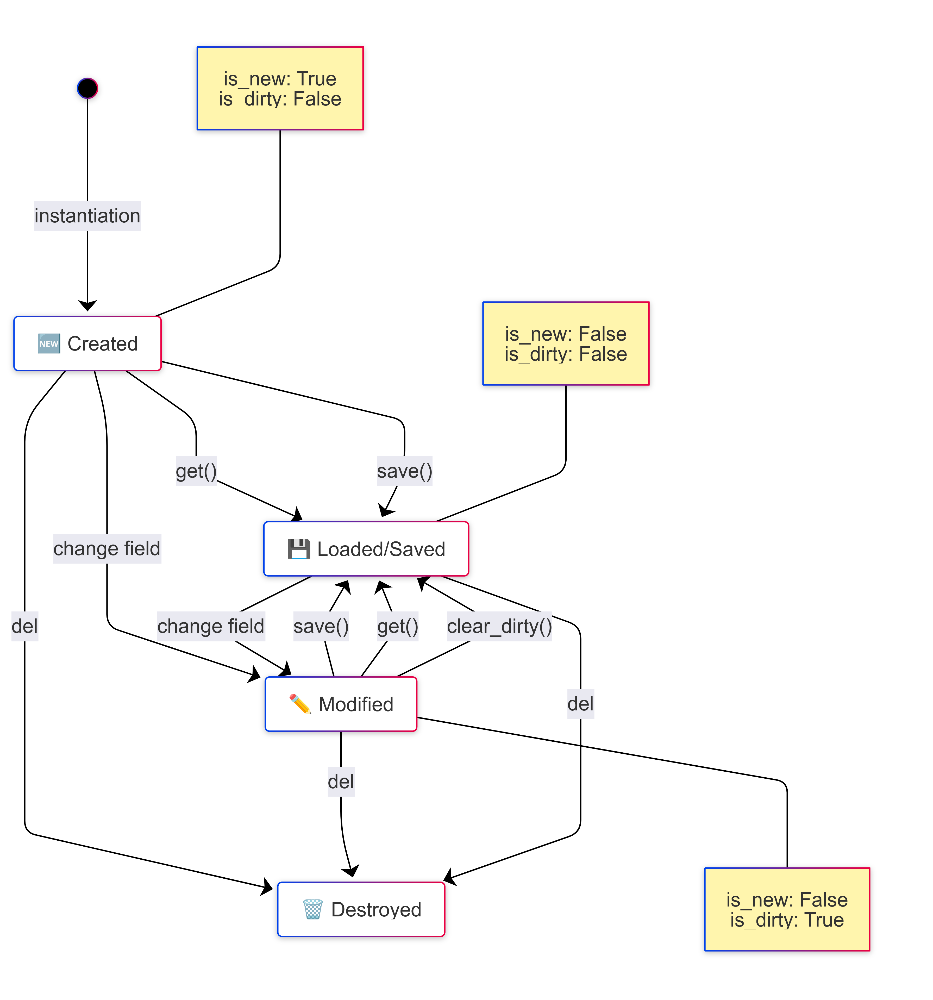

# Pydantic Tracking – Change Tracking for Pydantic Models

## Overview

`pydantic-tracking` is a Python mixin that adds **dirty tracking** and **onchange/onchanged hooks** to Pydantic models (v2). This enables reliable detection of changed fields and supports actions like efficient persistence or custom validation.

## Motivation

In data-driven applications, it's often important to answer:

* Which fields in a model have changed?
* Does the model need to be saved?
* Should a callback or hook be triggered upon changes?

Since Pydantic does not natively support change tracking, `TrackingMixin` was developed to fill this gap in an elegant way.

---

## Core Concepts

Tracking is based on three main ideas:

1. **Dirty Tracking**: All changed fields are recorded internally.
2. **Container Tracking**: Mutations in lists, dictionaries, and sets are also detected.
3. **Hook Support**: Optional `onchange` and `onchanged` callbacks can be implemented.

---

## Implementation Overview

### 1. `TrackingMixin`

The mixin adds the following methods to any Pydantic model:

```python
class TrackingMixin:
    def is_dirty(self) -> bool: ...
    def is_new(self) -> bool: ...
    def dirty_fields(self) -> set[str]: ...
    def clear_dirty(self): ...
    def save(self, force: bool = False): ...
```

The logic detects changes to fields (including nested containers like `List`, `Dict`, `Set`) and manages the internal state.

### 2. Container Tracking with `TrackedList`, `TrackedDict`, `TrackedSet`

Standard Python containers do not detect mutations. These are replaced with subclasses using `TrackedContainerMixin`:

```python
m.tags = TrackedList([1, 2, 3], ...)
m.tags.append(4)  # This is tracked and marks the model as 'dirty'
```

These classes override key methods (`append`, `pop`, `update`, `clear`, etc.) and notify the model of any mutation.

### 3. Hook Support

Optionally, the following methods can be implemented in your model:

```python
def onchange(self, field_name, new_value) -> bool: ...
def onchanged(self, field_name, old_value): ...
```

Typical use cases:

* Validation before applying a change (`onchange`)
* Logging after a change (`onchanged`)
* Blocking a change by returning `False` from `onchange`

Example:

```python
def onchange(self, name, value):
    if name == "price" and value < 0:
        return False  # Prevent negative prices
    return True
```

---

## Example Usage

```python
from pydantic import BaseModel
from pydantic_tracking import TrackingMixin

class MyModel(TrackingMixin, BaseModel):
    name: str
    values: list[int]

m = MyModel(name="Test", values=[1])
assert m.is_new()

m.values.append(2)
assert m.is_dirty()
assert "values" in m.dirty_fields()
```

---

## Detailed Explanation of `is_dirty` and `is_new`

### 1. `is_new`

* **What it means**: The model is newly created and has not been saved yet.
* **How it's determined**: On initialization, `_new = True`. After `save()` is called, `_new` is set to `False`.

Example:

```python
m = MyModel(field1=1)
assert m.is_new()  # New instance

m.save()
assert not m.is_new()  # Saved, not new anymore
```

### 2. `is_dirty`

* **What it means**: One or more fields have changed since the last save.
* **How it's tracked**: Changed fields are collected in `_dirty_fields`.

Detected changes include:

* Direct assignments: `model.field = value`
* Mutations in containers like `TrackedList`

`_dirty_fields` is cleared when:

* `save()` is called successfully
* `clear_dirty()` is called manually

Example:

```python
m = MyModel(field1=10)
assert m.is_dirty()  # Newly created, considered dirty

m.save()
assert not m.is_dirty()

m.field1 = 20
assert m.is_dirty()

m.clear_dirty()
assert not m.is_dirty()
```

---

## Internal Lifecycle

* **Initial State**:

  * `_new = True`
  * `_dirty_fields = {all initial fields}`
* **After save()**:

  * `_new = False`
  * `_dirty_fields = set()`
* **On Change**:

  * Changed field is added to `_dirty_fields`
* **Hooks**:

  * Can block or respond to changes



### Why distinguish `is_new` and `is_dirty`?

* **`is_new`**: Indicates the model was never saved (e.g. new DB record)
* **`is_dirty`**: Indicates the model has unsaved changes (e.g. requires update)

---

## Test Coverage

Comprehensive tests include:

* Initialization tracking
* Field mutation
* Container tracking (`list`, `dict`, `set`)
* Hook behavior
* Missing `save()` method handling
* Full method coverage for `containers.py`

---

## Tooling Support

### Makefile

Simple targets for key development tasks:

```bash
make install     # Setup virtual environment with Hatch
make test        # Run tests with coverage
make lint        # Run Ruff for linting
make format      # Run Ruff for formatting
make build       # Build the package
make publish     # Publish to PyPI
```

### pyproject.toml

Defines:

* Project metadata
* Hatch build system
* Development dependencies (`pytest`, `ruff`)
* Minimum Python version (>=3.8)

This makes the project **PyPI-ready** and suitable for CI/CD workflows.

---

## Design Decisions

| Decision                                | Rationale                                               |
| --------------------------------------- | ------------------------------------------------------- |
| Use of Pydantic v2                      | Modern parsing and validation                           |
| Use of Hatch                            | Simplified versioning, environment and publishing       |
| No automatic container wrapping         | Explicit wrapping ensures full control                  |
| `Tracked*` containers vs property hacks | More stable, complete method coverage, and Pythonic API |
| Separate `onchange` and `onchanged`     | Clear before/after change separation                    |
| Warn on missing `save()` method         | More robust for flexible models                         |

---

## Future Ideas

* Integration with ORMs like SQLAlchemy
* Plugin system for automatic persistence
* Async support for `save()`

---

## Conclusion

`pydantic-tracking` is a lightweight and effective solution for change tracking in Pydantic models. With its clear design, modular architecture, and full test coverage, it is ideal for applications that prioritize data integrity, performance, and extensibility.

